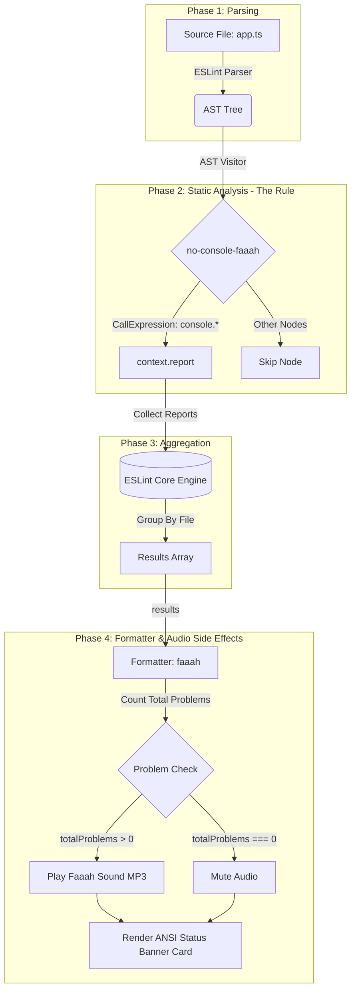

# `@ezihegodswill/eslint-plugin-console-faaah`

An audio-interactive ESLint plugin and custom formatter built using **Bun**, **TypeScript**, **AST Traversal**, and **MP3 Audio Playback**.

When linting your codebase, this plugin flags console statements (e.g. `console.log`, `console.error`, `console.warn`, `console.info`, computed property access `console['log']`) and triggers the signature **"Faaah"** sound effect when issues are detected:

- ✨ **Clean Codebase (0 issues)**: No sound played. (`Active Sound: None`)
- 💥 **Console Issues Detected (>0 issues)**: Plays `fahhh-pump-sound.mp3` (`Active Sound: Faaah Sound 💥`)

---

## 🎯 Key Architectural Concepts

### 1. AST Traversal & All Console Methods Matching

- **Abstract Syntax Tree (AST):** Source code parsing turns raw TypeScript/JavaScript code strings into a structured tree representation.
- **Computed & Static Property Matching:** The rule inspects `CallExpression` nodes where `callee.object.name === 'console'`. It flags all `console.*` method invocations by default (including computed properties like `console['log']()`).
- **Configurable Methods Filter:** Optionally specify target methods (e.g., `methods: ['log', 'warn']`) to scope the rule.

### 2. Audio Playback Side Effects

The custom `faaah` formatter aggregates total problem counts (`totalProblems`):

- **Clean Run (`totalProblems === 0`)**: Mutes audio playback.
- **Issues Found (`totalProblems > 0`)**: Plays **Faaah Sound** (`fahhh-pump-sound.mp3`) using native OS CLI players (`afplay` on macOS, `mpg123`/`paplay`/`ffplay`/`mpv` on Linux, PowerShell on Windows).

### 3. Custom ESLint Formatter API & Status Card

- Formatters receive `ESLint.LintResult[]` objects aggregated across all linted files.
- The `faaah` formatter renders a formatted ANSI CLI status box summarizing total problems and active audio status.

---

## 🚀 Quick Start

### Installation

```bash
bun add -d @ezihegodswill/eslint-plugin-console-faaah
```

### 1. ESLint Configuration

#### ESLint v9+ Flat Config (`eslint.config.js`)

```javascript
import consoleFaaah from "@ezihegodswill/eslint-plugin-console-faaah";

export default [consoleFaaah.configs["flat/recommended"]];
```

#### Legacy Config (`.eslintrc.cjs`)

```javascript
module.exports = {
  plugins: ["@ezihegodswill/eslint-plugin-console-faaah"],
  rules: {
    "@ezihegodswill/console-faaah/no-console-faaah": "error",
  },
};
```

### Rule Options (Filtering or Ignoring Console Methods)

By default, all console methods are flagged. You can specify `methods` to include or `ignore` to exclude specific methods:

```javascript
// Scope to specific methods:
'@ezihegodswill/console-faaah/no-console-faaah': ['error', { methods: ['log', 'warn'] }]

// Or ignore specific methods:
'@ezihegodswill/console-faaah/no-console-faaah': ['error', { ignore: ['trace', 'debug'] }]
```

### 🛠️ Auto-Fixing (`--fix`)

The `no-console-faaah` rule supports ESLint's auto-fixer. Automatically remove all offending console statements by running:

```bash
bunx eslint src/ --fix
```

### 2. Standalone CLI & Custom `faaah` Formatter

You can run the standalone CLI binary directly:

```bash
npx console-faaah src/
```

Or pass the custom formatter to ESLint CLI manually:

```bash
bunx eslint src/ -f @ezihegodswill/eslint-plugin-console-faaah/formatters/faaah
```

### 🔕 Muting & CI Environment Controls

Audio playback can be controlled using environment variables:

| Environment Variable  | Value        | Description                                                                             |
| --------------------- | ------------ | --------------------------------------------------------------------------------------- |
| `FAAAH_DISABLE_AUDIO` | `true` / `1` | Mutes all audio playback.                                                               |
| `CI`                  | `true` / `1` | Automatically mutes audio in continuous integration environments (e.g. GitHub Actions). |

> **Note:** During unit test execution (`NODE_ENV=test` or `bun test`) or CI builds (`CI=true`), audio playback is automatically muted so tests run quietly.

---

## 🛠️ Development & Testing

```bash
# Type check with strict TypeScript
bun run check-types

# Run unit tests with Bun native test runner
bun test

# Build production ESM bundle with Bun native bundler
bun run build

# Generate changesets for release management
bun run changeset
```

---

## 📜 System Architecture Flowchart



---

## 📄 License

MIT © Godswill Ezihe
