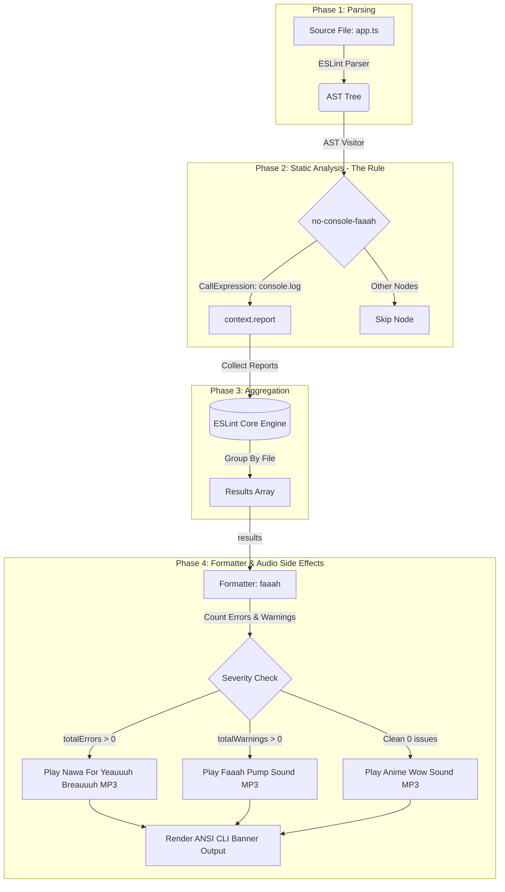

# `@ezihegodswill/eslint-plugin-console-faaah` 🔊

A production-ready audio-interactive ESLint plugin and custom formatter built from scratch using **Bun**, **TypeScript**, **AST Traversal**, and **MP3 Audio Playback**.

When linting your codebase, this plugin flags offending `console.log` statements and triggers appropriate pre-recorded `.mp3` sound effects depending on the rule severity:

- ✨ **Clean Codebase (0 issues)**: Plays `anime-wow-sound-effect.mp3`
- 🔊 **Warning Flag (`severity: "warn"`)**: Plays `fahhh-pump-sound.mp3`
- 💥 **Error Flag (`severity: "error"`)**: Plays `nawa-for-yeauhhhh-breauhhhh.mp3`

---

## 🎯 Key Architectural Concepts

### 1. Compiler Architecture & AST Traversal
- **Abstract Syntax Tree (AST):** Source code parsing turns raw TypeScript code strings into a tree representation.
- **Visitor Pattern & Selectors:** The rule registers an AST visitor for `CallExpression` nodes where `callee.object.name === 'console'` and `property.name === 'log'`.
- **Pure Rule Contract:** ESLint rules inspect AST nodes and report diagnostic locations without performing global side effects. Side effects are deferred strictly to presentation layers.

### 2. Severity-Based Audio Sound Effects
The custom formatter aggregates `errorCount` and `warningCount` across lint results:
- **Clean Run (`totalErrors === 0 && totalWarnings === 0`)**: Plays **Anime Wow Sound**.
- **Warning (`totalWarnings > 0 && totalErrors === 0`)**: Plays **Faaah Pump Sound**.
- **Error (`totalErrors > 0`)**: Plays **Nawa For Yeauuuh Breauuuh**.

### 3. Custom ESLint Formatter API & Native Playback
- Custom formatters receive an array of `ESLint.LintResult` objects aggregated across all files.
- The `faaah` formatter resolves bundled `.mp3` audio files and triggers native cross-platform audio playback (`afplay` on macOS, `mpg123`/`paplay`/`ffplay`/`mpv` on Linux, PowerShell Windows Media Player on Windows), formatting an ANSI-styled CLI status card.

### 4. Modern Bun Tooling Stack
- **Bun Native Bundler (`bun build`):** Fast ESM module bundling.
- **Bun Native Test Runner (`bun:test`):** Lightning-fast unit testing integrated with ESLint `RuleTester`.
- **Git Hooks:** `simple-git-hooks` pre-commit hooks enforcing type checks and unit test execution.
- **Versioning:** `@changesets/cli` for automated semantic release management.

---

## 🚀 Quick Start

### Installation

```bash
bun add -d @ezihegodswill/eslint-plugin-console-faaah
```

### 1. ESLint Configuration (`.eslintrc.cjs` or Flat Config)

```javascript
module.exports = {
  plugins: ['@ezihegodswill/eslint-plugin-console-faaah'],
  rules: {
    '@ezihegodswill/console-faaah/no-console-faaah': 'error', // or 'warn'
  },
};
```

### 2. Running with Custom `faaah` Formatter

```bash
bunx eslint src/ -f @ezihegodswill/eslint-plugin-console-faaah/formatters/faaah
```

### 🔕 Muting & CI Environment Controls

Audio playback can be controlled using environment variables:

| Environment Variable | Value | Description |
| --- | --- | --- |
| `FAAAH_DISABLE_AUDIO` | `true` / `1` | Mutes all audio playback. |
| `CI` | `true` / `1` | Automatically mutes audio in continuous integration environments (e.g. GitHub Actions). |
| `FAAAH_ENABLE_AUDIO` | `true` / `1` | Forces audio playback on even in CI environments. |

> **Note:** During unit test execution (`NODE_ENV=test`) or CI builds (`CI=true`), audio playback is automatically muted by default so tests run quietly.

---

## 🛠️ Development & Testing

```bash
# Type check with strict TypeScript
bun run check-types

# Run unit tests with Bun native test runner
bun test

# Build production ESM bundle with Bun native bundler
bun run build

# Generate changesets for release management
bun run changeset
```

---

## 📜 System Architecture Flowchart



---

## 📄 License
MIT © Godswill Ezihe
